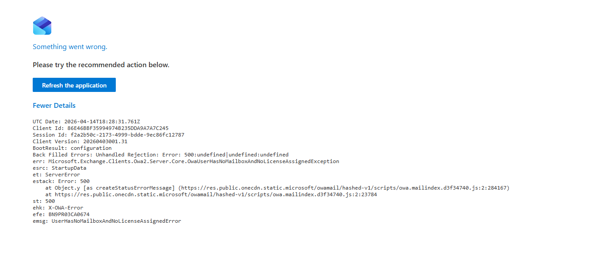
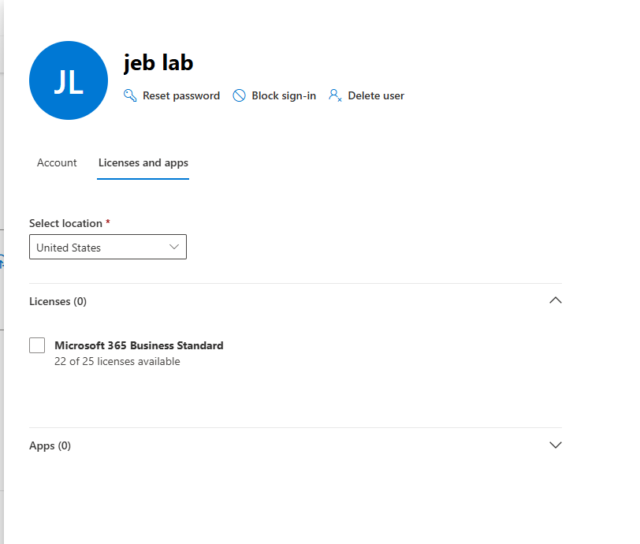
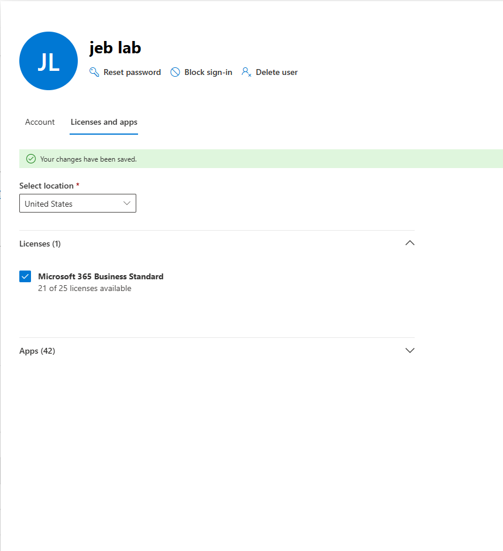
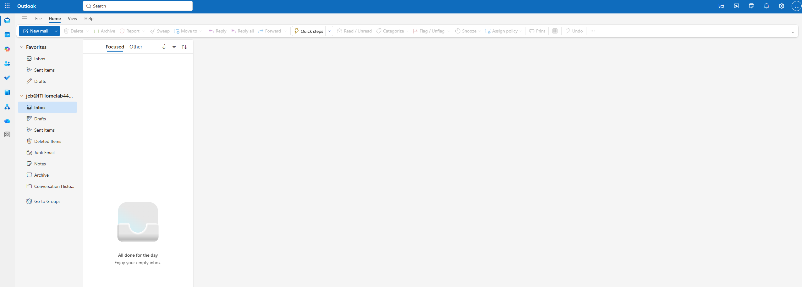

# Ticket: License Removal Impact

## Issue
User lost access to email and Microsoft 365 services.

## Cause
Microsoft 365 license was removed from user account.

## Troubleshooting Steps

1. Verified issue by attempting to access user services  

2. Checked license status in Admin Center  

3. Reassigned Microsoft 365 license  

## Resolution
User access to email and services restored after license reassignment.

## Skills Used
- License management  
- Service restoration  
- Troubleshooting cloud-based applications
