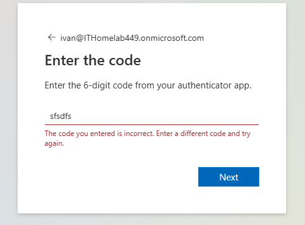
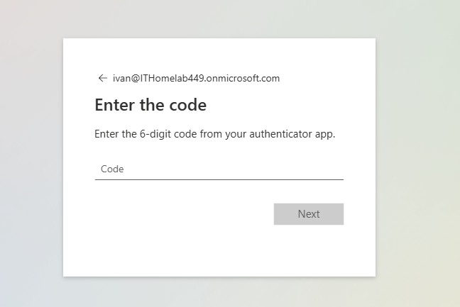
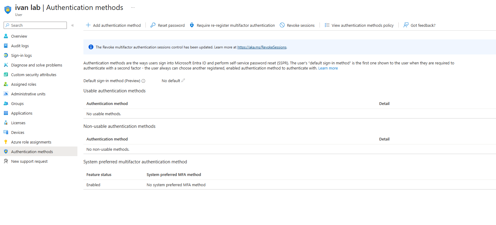
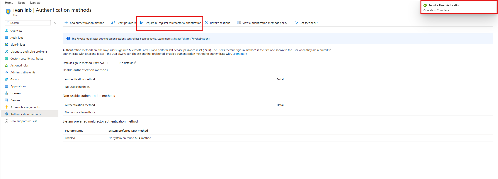
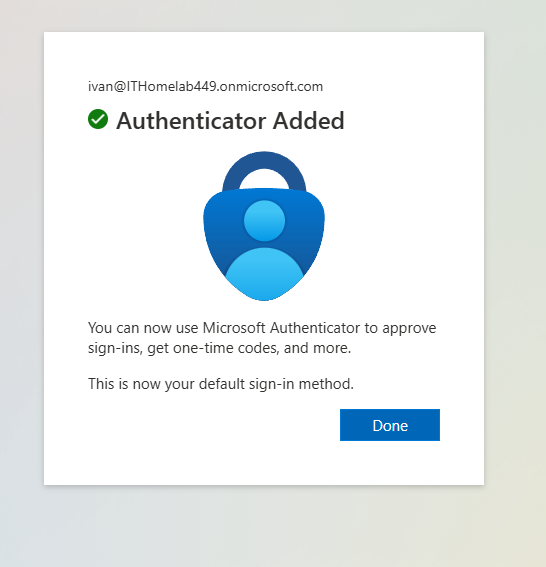

# Ticket: MFA Not Working

## Issue
User unable to complete MFA authentication and access Microsoft 365.

## Cause
MFA was not fully configured or user setup was incomplete.

## Troubleshooting Steps

1. Reproduced issue during login  

2. Checked user MFA configuration in Entra ID  

3. Reset MFA registration and required user to reconfigure  

4. Guided user through MFA setup process  

## Resolution
User successfully configured MFA and gained access to account.

## Skills Used
- Identity and access management  
- Security troubleshooting  
- User support and guidance
