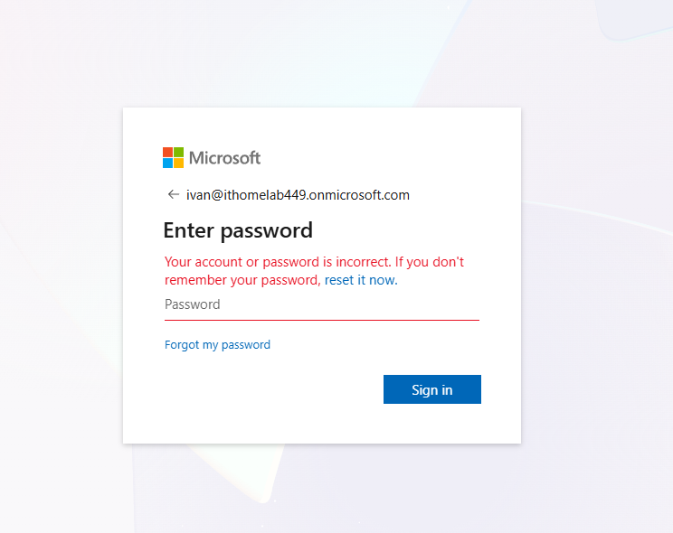
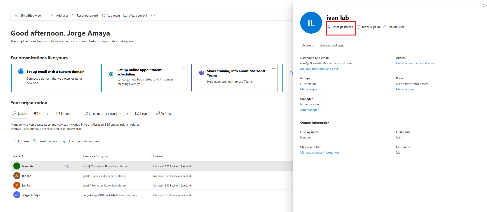
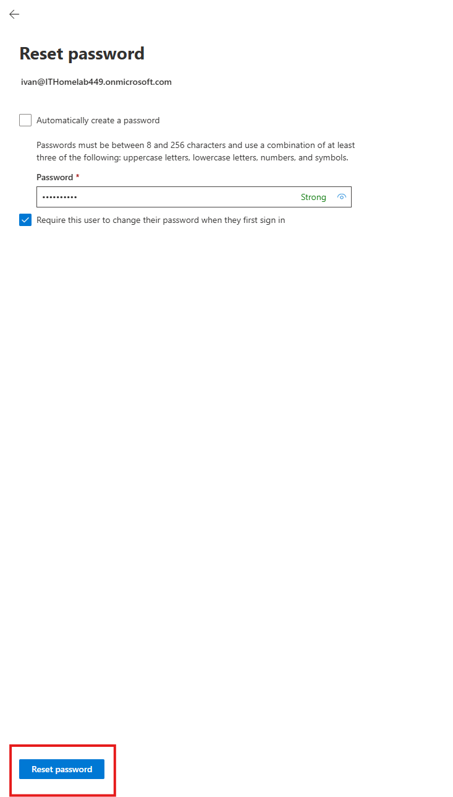

# Ticket: Password Reset

## Issue
User unable to log into Microsoft 365 account.

## Cause
User forgot password.

## Troubleshooting Steps
1. Accessed Microsoft 365 Admin Center  

2. Initiated password reset  

3. Generated temporary password  

## Resolution
User logged in successfully and updated password.  

## Skills Used
- Account management  
- User authentication support  
